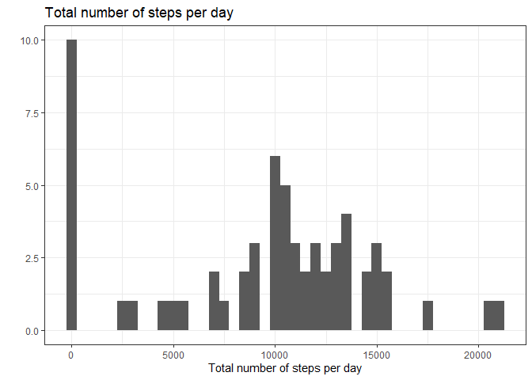
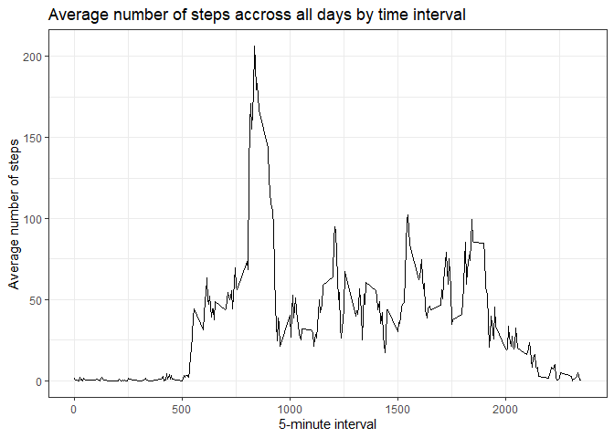
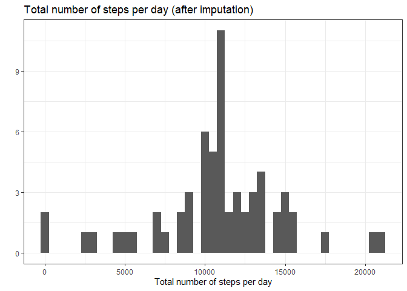
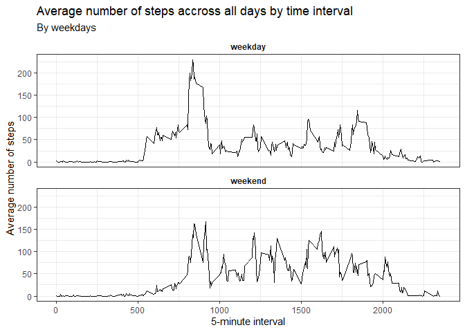

## Loading and preprocessing the data

As a first step, we are going to load the data and assigned them into the `activity` object.


```r
# Read the dataset
activity <- read.csv(unz("activity.zip", "activity.csv"))
```

The `activity` object is a data.frame object, with 17568 rows and 3 columnns (steps, date, interval).

In order to manipulate the data and create the plots, we need to load the useful libraries (removing the warning conglicts to faciliate the reading of this document).


```r
library(dplyr, warn.conflicts = FALSE)
library(ggplot2, warn.conflicts = FALSE)
```

Before analyzing the data, we will transform the date variable into a `Date` format.


```r
# Change the format of the data variable to Date format
activity <- activity %>% 
    mutate(date = as.Date(date, "%Y-%m-%d"))
```

## What is mean total number of steps taken per day?

The first step is to calculate the total number of steps taken by day. A new dataframe called `stepsSumDay` will be created for that purpose.


```r
# Create a summary dataset with the total number of steps taken by day 
stepsSumDay <- activity %>% 
    group_by(date) %>% 
    summarize(stepsSum = sum(steps, na.rm = TRUE), .groups = 'drop') %>% 
    as.data.frame()
```

The `stepsSumDay` object is a data.frame object, with 61 rows and 2 columnns (date, stepsSum).

We can quickly visualize the total number of steps by day using an histogram. Note that an histogram is highly dependent on the binwidth and other graphical displays could be more informative.


```r
# Histogram of the total number of steps taken by day 
qplot(stepsSumDay$stepsSum, geom = "histogram", xlab = "Total number of steps per day", main = "Total number of steps per day", binwidth = 500) +
    theme_bw()
```

<!-- -->

We can calculate summary statistics on the total number of steps per day.


```r
# Calculate the average and median of the total number of steps per day
stepsSumDayAverage = round(mean(stepsSumDay$stepsSum),2)
stepsSumDayMedian = median(stepsSumDay$stepsSum)
```
The average total number of steps per day is 9354.23 (rounded at 2 decimals) and the median is 10395.

## What is the average daily activity pattern?


The first step is to calculate the average number of steps taken across all days by 5-minute interval. A new dataframe called `stepsAverageInterval` will be created for that purpose.


```r
# Create a summary dataset with the average number of steps taken across all days by 5-minute interval
stepsAverageInterval <- activity %>% 
    group_by(interval) %>% 
    summarize(stepsAverage = mean(steps, na.rm = TRUE), .groups = 'drop') %>% 
    as.data.frame()
```

The `stepsAverageInterval` object is a data.frame object, with 288 rows and 2 columns (interval, stepsAverage).

We can quickly visualize the time series of the average number of steps taken across all days by 5-minute interval.


```r
# Line plot of the average number of steps taken across all days by 5-minute interval
qplot(x = stepsAverageInterval$interval, y = stepsAverageInterval$stepsAverage, geom = "line", xlab = "5-minute interval", ylab = "Average number of steps", main = "Average number of steps accross all days by time interval")+
    theme_bw()
```

<!-- -->

We can now calculate which 5-minute interval, on average across all the days in the dataset, contains the maximum number of steps.


```r
# Get the 5-minute interval, on average across all the days in the dataset, which contains the maximum number of steps
stepsAverageIntervalMax = stepsAverageInterval %>% 
    slice_max(stepsAverage) %>% 
    select(interval) %>% 
    as.numeric()
```

On average across all the days, the 5-minute interval which contains the maximum number of steps is the interval 835.

## Imputing missing values

As seen before, the NA were not used in the previous analysis but there are many missing data. 


```r
# Calculate the number and proportion of missing rows in the datasets
stepsNAn = sum(is.na(activity$steps))
stepsNApct = scales::percent(stepsNAn/nrow(activity), accuracy = 0.1)
```

The total number of rows with missing data for the steps variable is 2304 which represents 13.1% of the entire dataset.

We will impute the missing number of steps using the average across all days for that specific 5-minute interval. Remember that this information has already been calculated in the previous question.


```r
# Create a dataset with imputed missing steps
activityComplete = activity %>% 
    filter(is.na(steps)) %>% #keep the rows with missing steps only
    select(date, interval) %>% 
    left_join(., stepsAverageInterval, by = "interval") %>% # merge with the averal accross all days per interval
    rename(steps = stepsAverage) %>% 
    rbind(filter(activity, !is.na(steps))) %>% # bind the imputed rows with the activity dataset containing non-missing rows
    arrange(date, interval)
```

Then we can calculate the total number of steps taken by day after having imputed the missing steps. A new dataframe called `stepsSumDayComplete` will be created for that purpose.


```r
# Create a summary dataset with the total number of steps taken by day after imputation
stepsSumDayComplete <- activityComplete %>% 
    group_by(date) %>% 
    summarize(stepsSum = sum(steps), .groups = 'drop') %>% 
    as.data.frame()
```

The `stepsSumDayComplete` object is a data.frame object, with 61 rows and 2 columnns (date, stepsSum).

We can quickly visualize the total number of steps by day using an histogram. Note that an histogram is highly dependent on the binwidth and other graphical displays could be more informative.


```r
# Histogram of the total number of steps taken by day  after imputation
qplot(stepsSumDayComplete$stepsSum, geom = "histogram", xlab = "Total number of steps per day", main = "Total number of steps per day (after imputation)", binwidth = 500) +
    theme_bw()
```

<!-- -->

We can calculate summary statistics on the total number of steps per day after having imputed the missing steps.


```r
# Calculate the average and median of the total number of steps per day after imputation
stepsSumDayCompleteAverage = round(mean(stepsSumDayComplete$stepsSum),2)
stepsSumDayCompleteMedian = median(stepsSumDayComplete$stepsSum)

# Calculate the difference of average and median of the total number of steps per day after and before imputation
stepsSumDayCompleteAverageDiff = stepsSumDayCompleteAverage - stepsSumDayAverage
stepsSumDayCompleteMedianDiff = stepsSumDayCompleteMedian - stepsSumDayMedian

# Compare the average and median of the total number of steps per day after and before imputation
stepsSumDayCompleteAverageCompare = ifelse(stepsSumDayCompleteAverageDiff > 0, "increased", "decreased")
stepsSumDayCompleteMedianCompare = ifelse(stepsSumDayCompleteMedianDiff > 0, "increased", "decreased")
```

The average total number of steps per day is 10766.19 (rounded at 2 decimals) and the median is 10766.19.

By imputing the missing data, the average total number of steps per day has increased (1411.96) and the median has increased (371.1886792).

## Are there differences in activity patterns between weekdays and weekends?

In order to assess if there differences in activity patterns between weekdays and weekends, we first need to create a new factor variable called day with two levels, “weekday” and “weekend” indicating whether a given date is a weekday or weekend day. For the purpose of this question, we will use the previously imputed dataset.


```r
# Create a new variable factor for weekday/weekend
activityComplete <- activityComplete %>% 
    mutate(day = factor((weekdays(date)=="Saturday" | weekdays(date)=="Sunday"), labels = c("TRUE" = "weekday", "FALSE" = "weekend")))
```

We can now graphically vizualise if we observe a different patterns between weekdays and weekends, in the average number of steps taken, averaged across all weekday days or weekend days. The first step is to calculate the average number of steps taken across all weekday days or weekend days by 5-minute interval. A new dataframe called `stepsDaysAverageInterval` will be created for that purpose.


```r
# Create a summary datasets with the average number of steps taken across all days by 5-minute interval after imputation
stepsDaysAverageInterval <- activityComplete %>% 
    group_by(day, interval) %>% 
    summarize(stepsAverage = mean(steps, na.rm = TRUE), .groups = 'drop') 
```

The `stepsDaysAverageInterval` object is a tbl_df, tbl, data.frame object, with 576 rows and 3 columns (day, interval, stepsAverage).

We can quickly visualize the time series of the average number of steps taken across all days by 5-minute interval.


```r
# Line plot of the average number of steps taken across all days by 5-minute interval, by weekday/weekend
ggplot(data = stepsDaysAverageInterval, aes(x = interval, y = stepsAverage)) +
    geom_line() +
    facet_wrap( ~ day, nrow = 2) +
    xlab("5-minute interval") +
    ylab("Average number of steps") +
    labs(title = "Average number of steps accross all days by time interval", subtitle = "By weekdays") +
    theme_bw() +
    theme(strip.background = element_blank(),
          strip.text.x = element_text(face="bold"))
```

<!-- -->

We can clearly see differences in activity patterns between weekdays and weekends
